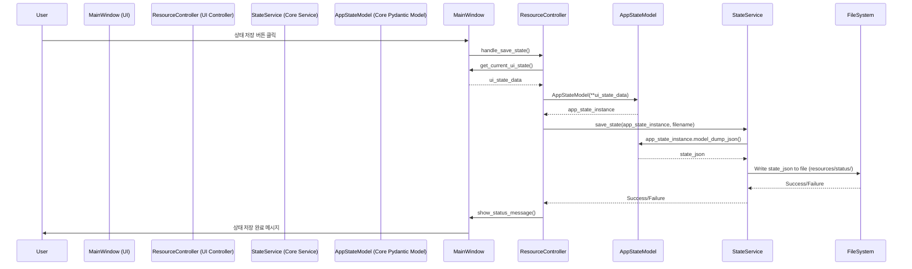

# DuckPrompt 코드 리팩토링 최종 계획 보고서 (v3.1 - 토큰 기준 적용)

## 1. 코드 분석 결과

## 1.1. 현재 코드 구조 및 기능 분석

- **핵심 기능**: 코드 강화 빌더, 메타 프롬프트 빌더, PyQt5 GUI, 파일 탐색/선택(.gitignore 필터링), XML 파서, 템플릿/상태 관리, 설정 관리(config.yml), 유틸리티(토큰 계산 등).
- **구조**: 모든 `.py` 파일이 루트에 위치. `app.py` (진입점), `main_window.py` (UI 정의), `main_controller.py` (이벤트 처리 및 핵심 로직) 중심으로 구성. 나머지 파일들은 특정 기능을 담당하나 구조적으로 분리 부족.

## 1.2. 식별된 주요 문제점 및 개선 필요 영역

1. **낮은 모듈성 및 응집도**: `main_window.py`, `main_controller.py`가 너무 많은 책임(UI, 이벤트, 로직, 상태 호출 등)을 가지며 SRP(단일 책임 원칙) 위반. 가독성 및 유지보수성 저하.
2. **강한 결합도 및 순환 참조 위험**: UI(`main_window`)와 로직(`main_controller`) 간 강한 결합. `main_controller`가 거의 모든 모듈을 직접 호출하는 중앙 집중 구조. `config`, `utils` 등 다수 파일에서 직접 참조되어 순환 참조 위험 존재.
3. **테스트 어려움**: UI-로직 결합으로 유닛 테스트 작성 난이도 높음. 핵심 로직(`state_manager` 등) 검증 부재.
4. **경로 관리**: `get_resource_path` 사용 혼재 및 하드코딩된 경로(`resources/...`) 분산. 향후 `src/` 구조 변경 시 import 경로 문제 발생 가능성.
5. **가독성**: 콜백 메서드와 UI 구성 로직 혼재, 로직 블록 간 명확한 구분 부족.
6. **타입 안정성 및 데이터 유효성 부족**: 런타임 오류 가능성, 상태/설정 데이터 형식 불명확.

## 1.3. 코드 복잡도, 의존성 관계, 주요 패턴 분석

- **복잡도**: `main_window.py`, `main_controller.py`의 순환 복잡도 높음 예상.
- **의존성**: UI → Controller → Core/Utils 계층 구조는 보이나, Controller에 로직 과집중. 일부 UI가 Core/Utils 직접 사용.

```mermaid
flowchart LR
    subgraph UI
      A[app.py] --> B((main_window.py))
      B --> C[Custom Widgets]
      B --> D[File System Models]
    end
    subgraph Controller
      F((main_controller.py)) # 분리 예정
    end
    subgraph Core & Utils
      G[prompt_manager.py] # prompt_service.py로 이동 예정
      H[parse_xml_string.py] # xml_service.py로 이동 예정
      I[state_manager.py] # state_service.py로 이동 예정
      J[template_manager.py] # template_service.py로 이동 예정
      K[config.py] # config_service.py 및 config.yml로 대체 예정
      L[utils.py] # helpers.py로 이동 예정
    end

    UI -- Events --> Controller
    Controller -- Calls --> Core & Utils
    UI -- Uses --> Core & Utils # 최소화 필요
```

- **패턴**: 전형적인 절차적 GUI 프로그래밍. MVC/MVVM 등 아키텍처 패턴 적용 미흡.

---

## 2. 리팩토링 전략

## 2.1. 기능별 코드 분리 계획 (계층화)

1. **`src/ui` (UI 계층)**: 사용자 인터페이스 담당 (PyQt5).
   - `main_window.py`: 메인 윈도우 레이아웃/위젯 정의.
   - `widgets/`: 재사용 커스텀 위젯 (`CustomTextEdit`, `CustomTabBar` 등).
   - `models/`: UI 표현 모델 (`FilteredFileSystemModel`, `CheckableProxyModel`).
   - `controllers/`: UI 이벤트 처리 및 Core 서비스 호출 담당 (`main_controller.py` 분리).
     - `main_controller.py`, `file_tree_controller.py`, `resource_controller.py`, `prompt_controller.py`, `xml_controller.py`, `system_prompt_controller.py`.
2. **`src/core` (Core 계층)**: UI 독립적 핵심 비즈니스 로직. **Pydantic 모델** 적극 활용.
   - `pydantic_models/`: **Pydantic 모델 정의** (`app_state.py`, `config_settings.py`, `xml_change.py` 등).
   - `services/`: 실제 로직 수행 서비스.
     - `prompt_service.py`: 프롬프트 생성 로직.
     - `xml_service.py`: XML 파싱 및 파일 적용 로직.
     - `state_service.py`: 상태 저장/로드/관리 로직 (Pydantic 모델 사용).
     - `template_service.py`: 템플릿 관리 로직.
     - `filesystem_service.py`: 파일 시스템 관련 로직 (`.gitignore` 처리 등).
     - `config_service.py`: 설정 로드 및 관리 (**Pydantic 모델 사용**, `src/config.yml` 파일 연동).
3. **`src/utils` (유틸리티 계층)**: 범용 헬퍼 함수.
   - `helpers.py`: 토큰 계산, 리소스 경로 관리 등.
4. **`src/app.py` (애플리케이션 설정 및 실행 로직)**: 애플리케이션 설정, Core 서비스 초기화, 메인 윈도우 생성/실행 로직.
5. **`main.py` (루트 경로)**: `src/app.py`를 임포트하여 애플리케이션을 실행하는 간단한 스크립트.
6. **`src/config.yml`**: 애플리케이션 설정 파일 (YAML 형식). 기본 시스템 프롬프트 경로 등 포함.

## 2.2. `src/` 폴더 내부 구조 설계 방안

- 모든 Python 소스 코드를 `src/` 하위로 이동.
- `src/` 내부에 기능별 패키지(`ui`, `core`, `utils`) 생성.
- `core` 내부에 `pydantic_models`와 `services` 분리.
- `ui` 내부에 `widgets`, `models`, `controllers` 분리.
- 각 패키지 디렉토리에 `__init__.py` 파일 추가.

## 2.3. 모듈화 접근 방식 및 의존성 관리 전략

- **단일 책임 원칙 (SRP)**: 각 모듈/클래스/함수는 하나의 명확한 책임. 모듈 크기 **10000 토큰 이하** _가이드라인_ 설정 (**LLM의 컨텍스트 처리 효율성 고려**).
- **느슨한 결합 (Loose Coupling)**: 계층 간 의존성 최소화. Core는 UI를 몰라야 함. Controller는 UI와 Core 사이의 중재자 역할.
- **의존성 방향**: `UI` → `UI Controllers` → `Core Services` → `Core Pydantic Models / Utils / Config`. 역방향/건너뛰기 지양.
- **순환 참조 방지**: 설계 시 의존성 방향 명확화. 타입 힌트 시 `TYPE_CHECKING` 활용.
- **Import 관리**: `src/` 내부에서는 절대 경로 (`from src.core import ...`) 사용 권장.

## 2.4. 코드 품질 향상을 위한 구체적 방법론

- **타입 힌팅 & 정적 분석**: Python 3.12 타입 힌트 + **`mypy`** 정적 타입 검사 (Pydantic 플러그인 활성화).
- **데이터 유효성 검사**: **`pydantic`** 모델을 사용하여 상태, 설정 등 핵심 데이터 구조 정의 및 유효성 검사 자동화.
- **코딩 스타일**: `black` 포매터, `ruff` 린터 사용 (`pyproject.toml` 설정).
- **중복 제거**: 공통 로직 함수화, 공통 UI 위젯 분리.
- **로깅 전략**: 표준 `logging` 모듈 사용 (레벨 구분). `termcolor`는 개발/디버깅용 제한적 사용.
- **에러 처리**: 명확한 `try...except` 블록, 사용자 친화적 오류 메시지. Pydantic `ValidationError` 처리.
- **명명 규칙**: PEP 8 준수.

---

## 3. 예상 파일/디렉터리 구조

```text
duck-prompt/
├── main.py                  # 애플리케이션 실행 스크립트 (src/app.py 임포트)
├── src/
│   ├── __init__.py
│   ├── app.py             # 애플리케이션 설정 및 메인 윈도우 실행 로직
│   ├── config.yml         # 애플리케이션 설정 파일 (YAML 형식)
│   ├── core/
│   │   ├── __init__.py
│   │   ├── pydantic_models/ # Pydantic 모델 정의
│   │   │   ├── __init__.py
│   │   │   ├── app_state.py
│   │   │   ├── config_settings.py
│   │   │   └── xml_change.py # (필요시)
│   │   └── services/        # 비즈니스 로직 서비스
│   │       ├── __init__.py
│   │       ├── config_service.py # 설정 관리 (Pydantic, src/config.yml 로드)
│   │       ├── filesystem_service.py
│   │       ├── prompt_service.py
│   │       ├── state_service.py
│   │       ├── template_service.py
│   │       └── xml_service.py
│   ├── ui/
│   │   ├── __init__.py
│   │   ├── main_window.py   # 메인 윈도우 UI 구조
│   │   ├── controllers/     # UI 이벤트 핸들러 및 로직 조정
│   │   │   ├── __init__.py
│   │   │   ├── main_controller.py
│   │   │   ├── file_tree_controller.py
│   │   │   ├── resource_controller.py
│   │   │   ├── prompt_controller.py
│   │   │   ├── xml_controller.py
│   │   │   └── system_prompt_controller.py # 함수 형태 유지 또는 클래스화
│   │   ├── models/          # UI 데이터 모델 (PyQt 모델)
│   │   │   ├── __init__.py
│   │   │   └── file_system_models.py
│   │   └── widgets/         # 커스텀 위젯
│   │       ├── __init__.py
│   │       ├── common.py # 필요시 추가
│   │       ├── custom_tab_bar.py
│   │       └── custom_text_edit.py
│   └── utils/
│       ├── __init__.py
│       └── helpers.py       # 범용 헬퍼 함수
├── tests/                   # 유닛 테스트 코드 (루트 레벨)
│   ├── __init__.py
│   ├── core/
│   │   ├── __init__.py
│   │   ├── pydantic_models/ # Pydantic 모델 테스트
│   │   │   └── test_app_state.py
│   │   └── services/
│   │       ├── __init__.py
│   │       ├── test_state_service.py # 서비스 로직 테스트
│   │       └── ...
│   ├── ui/
│   │   ├── __init__.py
│   │   ├── models/
│   │   │   └── test_file_system_models.py
│   │   └── ...
│   └── utils/
│       ├── __init__.py
│       └── test_helpers.py
├── resources/               # 기존 구조 유지 (상태, 프롬프트 템플릿 등)
│   ├── prompts/
│   ├── status/
│   └── rubber_duck.ico
├── .gitignore
├── requirements.txt         # 기본 의존성 (pydantic 포함, python-dotenv 제거)
├── requirements-dev.txt     # 개발/테스트용 의존성 (mypy 포함)
├── pyproject.toml           # 프로젝트 설정 (uv, build, ruff, black, mypy)
└── README.md                # 업데이트된 README
```

---

## 4. 시각화 자료 (Mermaid)

## 4.1. 리팩토링 후 예상 아키텍처

```mermaid
graph TD
    subgraph UI_Layer [UI Layer]
        MainWindow[ui.main_window.py]
        Widgets[ui.widgets/*]
        UIModels[ui.models/*]
        Controllers[ui.controllers/*]

        MainWindow -- Contains --> Widgets
        MainWindow -- Uses --> UIModels
        MainWindow -- Events --> Controllers
        Controllers -- Updates --> MainWindow & UIModels
    end

    subgraph Core_Layer [Core Layer]
        PydanticModels[core/pydantic_models/*]
        Services[core/services/*]
        ConfigService[core/services/config_service.py]
    end

    subgraph Utils [Utility Layer]
        Helpers[utils.helpers.py]
    end

    EntryPoint[main.py] -- Runs --> App[src/app.py]
    App -- Creates --> MainWindow
    App -- Configures --> Services # 또는 MainWindow에서 서비스 생성/주입

    Controllers -- Calls --> Services
    Services -- Uses --> PydanticModels
    Services -- Uses --> Helpers
    # ConfigService -- Reads --> EnvFile[.env] # 제거됨
    ConfigService -- Reads_Writes --> ConfigFile[src/config.yml]

    style Core_Layer fill:#ccf,stroke:#333,stroke-width:2px
    style UI_Layer fill:#cfc,stroke:#333,stroke-width:2px
    style Utils fill:#ffc,stroke:#333,stroke-width:2px

```

## 4.2. 상태 저장 시퀀스 예시 (Pydantic 활용)



---

## 5. 단계별 리팩토링 계획 (2단계 구성)

## 5.1. 1단계: 환경 설정, 구조 생성, Core 분리 및 Pydantic 도입 (완료 가정)

- **목표**: 리팩토링 준비 완료, `src/` 구조 및 개발 환경 설정, Core 계층 분리 및 Pydantic 모델 도입, 초기 테스트 확보.
- **코드 작성 단계**: (완료됨)
- **Subtasks (Git, 테스트, 검증 등)**: (완료됨)

### 5.1.1. 주요 테스트 및 검증 항목 (pytest) (완료 가정)

- **`core/pydantic_models`**: 완료
- **`core/services`**: 완료 (ConfigService는 config.yml 로드/저장 검증 포함)
- **`utils/helpers`**: 완료

- **완료 기준**: Python 3.12 환경에서 `python main.py`로 프로젝트 실행 가능, 모든 코드가 `src/` 내부에 위치, Core/Utils 계층 분리 완료, Pydantic 모델 도입 완료, Core 모듈 UI 의존성 없음, Core/Utils 유닛 테스트 통과, `ruff`, `black`, `mypy` (Core/Utils 대상) 검사 통과, 애플리케이션 주요 기능 실행 가능.
- **검증 방법**: 수동 테스트, `uv pip list`, 애플리케이션 실행, `pytest tests/core tests/utils`, `ruff check .`, `mypy src/core src/utils`, 코드 리뷰 (SRP, 결합도, Pydantic 사용 적절성).

## 5.2. 2단계: UI 분리, 컨트롤러 리팩토링, 최적화 및 최종 검증 (진행 중)

- **목표**: UI 계층 분리 완료, 컨트롤러 리팩토링, 전체 타입 힌팅 완성 (`mypy` 통과), 코드 품질 극대화, 문서화, 최종 테스트 및 검증.
- **코드 작성 단계**:
  - [x] 커스텀 위젯 -> `src/ui/widgets/` 로 이동 및 리팩토링.
  - [x] 파일 탐색기 모델/로직 -> `src/ui/models/`, `src/ui/controllers/file_tree_controller.py` 로 이동 및 리팩토링.
  - [x] `main_window.py`: UI 정의만 남기고 이벤트 핸들러는 컨트롤러 호출로 변경.
  - [x] `main_controller.py`: 책임을 분할하여 `src/ui/controllers/` 아래 여러 컨트롤러(`main_controller`, `resource_controller`, `prompt_controller`, `xml_controller`, `file_tree_controller` 등)로 분산. Core 서비스 호출 로직 구현.
  - [ ] 전체 코드베이스 타입 힌트 적용 완료.
  - [ ] 복잡 로직 재검토 및 단순화 리팩토링.
  - [ ] 중복 코드 검토 및 제거.
  - [ ] 클래스/주요 함수 Docstring 추가 (Google 스타일 권장). 코드 내 주석 보강.
- **Subtasks (Git, 테스트, 검증 등)**:
  - [ ] **Git**: 브랜치 생성 (`refactor/phase2-ui-separation-optimize`). 작은 단위로 커밋.
  - [ ] **정적 분석/포매팅**: 전체 코드베이스 `black .`, `ruff check .` 적용 및 모든 경고/오류 수정.
  - [ ] **타입 체크**: **`mypy src/` 전체 실행 및 모든 타입 오류 수정 (통과 필수)**.
  - [ ] **테스트 작성**: UI 컨트롤러 로직, UI 모델 등에 대한 유닛 테스트 보강 (`tests/ui/`). 유닛 테스트 커버리지 향상 (목표: 80% 이상).
  - [ ] **CI 설정**: CI 설정 (GitHub Actions 등) 추가/개선: `pytest`, `ruff`, `black --check`, **`mypy src/`** 자동 실행.
  - [ ] **성능**: (선택) 성능 병목 구간 식별 및 최적화.
  - [ ] **문서화**: `README.md` 최종 업데이트 (구조, 사용법, 테스트 방법 등).
  - [ ] **기능 검증**: 최종 기능 테스트 및 QA.
  - [ ] **패키징 검증**: 패키징 빌드 (`pyinstaller` 등) 재검증.
  - [ ] **병합**: 리팩토링 브랜치들을 메인 브랜치로 병합.

### 5.2.1. 주요 테스트 및 검증 항목 (pytest)

- **`ui/controllers`**: (`pytest-qt` 및 `mocker` 활용)
  - 각 컨트롤러의 이벤트 핸들러 함수 호출 시 예상되는 Core 서비스 함수 호출 여부 검증 (Mock 객체 사용).
  - Core 서비스로부터 받은 데이터를 UI 모델 또는 위젯에 올바르게 반영하는 로직 검증.
  - 사용자 입력(예: 파일 경로, 템플릿 이름) 처리 로직 검증.
  - 상태 변경(예: 모드 전환)에 따른 UI 업데이트 로직 검증.
  - 오류 발생 시 사용자에게 적절한 메시지(예: `QMessageBox`) 표시 로직 검증 (Mock 객체 사용).
- **`ui/models`**: (`pytest-qt` 활용)
  - `FilteredFileSystemModel`: 특정 경로 설정 시 파일 시스템 구조 로드 검증, 필터링 로직 검증 (`.gitignore` 패턴 기반).
  - `CheckableProxyModel`: 체크 상태 변경 시 데이터(`Qt.CheckStateRole`) 변경 및 `dataChanged` 시그널 발생 검증, 부모-자식 체크 상태 동기화 로직 검증, 필터링된 항목 처리 검증.
- **통합 테스트 (선택적)**:

  - UI 이벤트 발생부터 Core 서비스 호출 및 결과 반환까지의 주요 흐름 테스트 (예: 프로젝트 폴더 선택 -> 파일 트리 로드 및 필터링 -> 파일 체크 -> 프롬프트 생성). Mock 객체를 최소화하여 실제 객체 간 상호작용 검증.

- **완료 기준**: `src/` 하위 구조 계획대로 구현 완료, UI 계층 분리 완료, `black`, `ruff`, **`mypy`** 전체 검사 통과, 타입 힌트 완료, Docstring/주석 충분, 테스트 커버리지 목표 달성, 모든 기능 안정적 동작, `README.md` 최신화, 패키징 성공, CI 빌드 성공.
- **검증 방법**: `black --check .`, `ruff check .`, `mypy src/`, `pytest --cov=src tests/`, CI 결과 확인, 코드 리뷰, 최종 수동 테스트, 빌드된 패키지 테스트.

---

## 6. 유닛 테스트 전략

- **프레임워크**: `pytest`. 필요시 `pytest-qt`, `pytest-mock`.
- **테스트 위치**: 프로젝트 루트의 `tests/` 디렉토리.
- **테스트 대상**: Core 서비스 로직, **Pydantic 모델 유효성 검사**, Utils 함수 중점. UI 컨트롤러 로직 일부, UI 모델 검증.
- **테스트 구조**: `tests/` 아래 `src/` 구조 미러링.

  ```text
  tests/
  ├── __init__.py
  ├── core/
  │   ├── __init__.py
  │   ├── pydantic_models/ # Pydantic 모델 테스트
  │   │   └── test_app_state.py
  │   └── services/
  │       ├── __init__.py
  │       ├── test_state_service.py # 서비스 로직 테스트
  │       └── ...
  ├── ui/
  │   ├── __init__.py
  │   ├── models/
  │   │   └── test_file_system_models.py
  │   └── ...
  └── utils/
      ├── __init__.py
      └── test_helpers.py
  ```

- **명명 규칙**: 파일 `test_*.py`, 함수 `test_*`.
- **주요 테스트 케이스**:
  - **Pydantic 모델**: 필수 필드 누락, 타입 불일치, 커스텀 validator 등 유효성 검사 케이스.
  - `prompt_service`: 다양한 입력 조합 프롬프트 결과 검증.
  - `xml_service`: 유효/무효 XML 처리, 파일 연산(CRUD) 결과, 오류 처리.
  - `state_service`: 상태 저장/로드 (Pydantic 모델 직렬화/역직렬화 포함), 백업/복원.
  - `template_service`: 템플릿 CRUD.
  - `filesystem_service`: `.gitignore` 패턴 매칭.
  - `config_service`: 설정 로드 (Pydantic 모델 활용, `src/config.yml` 기반).
  - `ui.models.file_system_models`: 체크 상태 동기화, 필터링.
  - `utils.helpers`: 토큰 계산, 경로 반환.
- **구현**: `pytest` Fixtures (`tmp_path`), `mocker`, `parametrize`. Pydantic 모델 인스턴스 생성 및 검증.
- **실행**: `uv run pytest tests/`, 커버리지: `uv run pytest --cov=src tests/`.

---

## 7. 잠재적 위험 및 대응 전략

| 위험 요인                        | 대응 전략                                                                                      |
| :------------------------------- | :--------------------------------------------------------------------------------------------- |
| **Import 경로 충돌/오류**        | `src/` 루트 기반 절대 임포트(`from src...`) 표준화, `PYTHONPATH` 설정 확인 (`pyproject.toml`). |
| **기능 손실/변경**               | 단계별 기능 테스트(수동/자동), Git 활용(작은 단위 커밋, `git mv`), 코드 리뷰.                  |
| **순환 참조 발생**               | 설계 시 의존성 방향 명확화, 인터페이스/서비스 계층 도입, 정적 분석(ruff).                      |
| **UI-비즈니스 로직 분리 어려움** | 명확한 Controller 역할 정의, Core 서비스는 UI 독립성 유지, 점진적 분리.                        |
| **Git 이력 상실 (파일 이동 시)** | `git mv` 명령어 사용하여 파일 이동 추적 및 이력 보존.                                          |
| **테스트 커버리지 부족**         | 리팩토링과 병행하여 테스트 작성, CI에서 테스트 통과 강제, Core 로직 우선 테스트.               |
| **예상보다 많은 시간 소요**      | 단계 세분화, 우선순위 설정(구조 개선 > 모든 최적화), 페어 프로그래밍/리뷰 활용.                |

---

## 8. 환경 설정 계획

- **Python 버전**: Python 3.12
- **패키지 관리자**: **`uv`** 권장 및 기본 사용.
  - 가상환경: `uv venv`
  - 설치: `uv pip install -r requirements.txt`, `uv pip install -r requirements-dev.txt`
  - 실행: `uv run python main.py`, `uv run pytest ...`
- **의존성 파일**:
  - `requirements.txt`: `PyQt5`, `pyyaml`, `termcolor`, `tiktoken`, **`pydantic`**. (`python-dotenv` 제거)
  - `requirements-dev.txt`: `pytest`, `pytest-qt`, `pytest-mock`, `pytest-cov`, `ruff`, `black`, **`mypy`**.
- **`pyproject.toml`**: 프로젝트 설정 통합 관리.

  ```toml
  [project]
  name = "duckprompt"
  version = "1.1.0" # 리팩토링 후 버전 업데이트
  description = "GUI tool to build prompts for LLMs by integrating file contents."
  requires-python = ">=3.12"
  dependencies = [
      "PyQt5",
      "PyYAML", # config_service에서 YAML 사용 시 필요
      "termcolor",
      "tiktoken",
      # "python-dotenv", # 제거됨
      "pydantic>=2.0", # Pydantic v2 이상 명시
      # "pydantic-settings", # 필요시 추가
  ]

  [project.optional-dependencies]
  dev = [
      "pytest",
      "pytest-qt",
      "pytest-mock",
      "pytest-cov",
      "ruff",
      "black",
      "mypy",
      "radon", # 복잡도 측정용
  ]

  [build-system]
  requires = ["hatchling"]
  build-backend = "hatchling.build"

  # --- Tool Configurations ---
  [tool.uv]
  # uv 관련 설정 (필요시)

  [tool.ruff]
  line-length = 88
  select = ["E", "W", "F", "I", "UP", "B", "C4", "SIM", "PTH", "RUF"] # ruff 규칙셋 확장
  ignore = []
  # src 디렉토리 지정 (선택적)
  src = ["src", "tests"] # tests 디렉토리도 포함

  [tool.black]
  line-length = 88
  target-version = ['py312']
  include = '\.pyi?$'
  # tests 디렉토리도 포함하도록 설정 가능
  # include = '(\.pyi?|tests/.*\.py)$'

  [tool.mypy]
  python_version = "3.12"
  warn_return_any = true
  warn_unused_configs = true
  ignore_missing_imports = true # 초기 설정, 점진적으로 False 목표
  # Pydantic 플러그인 활성화!
  plugins = ["pydantic.mypy"]
  # 타입 체크 대상 경로 명시
  files = ["src", "tests"]

  # Pydantic 플러그인 세부 설정 (선택적)
  [tool.pydantic-mypy]
  init_forbid_extra = true
  init_typed = true
  warn_required_dynamic_aliases = true
  warn_untyped_fields = true

  [tool.pytest.ini_options]
  minversion = "6.0"
  addopts = "-ra -q --cov=src --cov-report=term-missing"
  testpaths = [
      "tests", # 테스트 경로 명시
  ]
  pythonpath = ["src"] # src 디렉토리를 PYTHONPATH에 추가
  ```

- **CI/CD**: GitHub Actions 활용. 워크플로우 정의 (`pytest`, `ruff`, `black --check`, `mypy src/ tests/` 실행).

---

## 9. README.md 업데이트 계획

- **프로젝트 구조**: 새로운 `src/` 기반 폴더 구조 설명 (core/pydantic_models, core/services, ui/controllers 등 포함), `tests/` 위치 명시.
- **설치 및 실행**: `uv` 기반 개발 환경 설정 및 실행 방법 명시 (`python main.py`).
- **설정**: `src/config.yml` 파일 설명 추가 (기본 시스템 프롬프트 등).
- **기술 스택**: Python 3.12, PyQt5, Pydantic, mypy, uv, pytest, ruff, black 등 주요 기술 언급.
- **테스트**: `pytest` 실행 방법 및 `mypy` 타입 체크 방법 안내 (`tests/` 디렉토리 기준).

---

## 10. 예상 결과물 및 기대 효과

- **결과물**: 섹션 3의 파일 구조, 섹션 4의 아키텍처 다이어그램, Pydantic/mypy가 적용된 코드, 업데이트된 문서.
- **기대 효과**:
  - **모듈성 향상**: 기능별 분리로 코드 이해 및 수정 용이 (**LLM 처리 효율성 증대**).
  - **테스트 용이성 증가**: Core 로직의 독립적 테스트 가능, 테스트 커버리지 확보.
  - **유지보수성 향상**: 낮은 결합도와 높은 응집도로 기능 추가/변경 시 영향 범위 최소화.
  - **코드 품질/안정성 향상**: 일관된 스타일, **타입 안정성(mypy)**, **데이터 유효성(Pydantic)** 확보, 런타임 오류 감소.
  - **개발 생산성 향상**: 명확한 구조, 자동 검증 도구 활용.
  - **협업 용이성 증대**: 표준화된 구조와 도구 사용.
